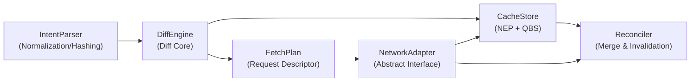

# FractalCache Design Document v2.0 (English)

## 0. Terminology Table (Unified Predefined Definitions)

| Term                       | Abbreviation | Definition                                                                                                                      |
|----------------------------|--------------|---------------------------------------------------------------------------------------------------------------------------------|
| **Entity**                 | -            | Business object with unique ID, e.g., `User`, `Post`                                                                            |
| **Normalized Entity Pool** | NEP          | Global normalized storage, key is `(EntityType, ID)`, value is `EntityRecord`                                                   |
| **Query Binding Store**    | QBS          | Caches executed list queries (including sorting, filtering, pagination intervals)                                               |
| **Intent**                 | -            | Complete description of data requirement, including `select`, `where`, `orderBy`, `skip`, `take`, `include`                     |
| **Query Binding**          | QueryBinding | A record in QBS, containing parameters, pagination intervals, ID mapping                                                        |
| **Sort Hash**              | SortHash     | Hash value generated by standardizing the `orderBy` clause, used to identify sort order                                         |
| **Filter Hash**            | FilterHash   | Hash value generated by standardizing the `where` clause, used for quick predicate comparison                                   |
| **Diff Engine**            | DiffEngine   | Core module, compares Intent with cache state, outputs `FetchPlan`                                                              |
| **Fetch Plan**             | FetchPlan    | Request descriptor containing "primary fetch" (fill IDs) and "enrichment fetch" (fill fields)                                   |
| **Reconciler**             | Reconciler   | Processes network responses, updates NEP and QBS, maintains interval continuity and metadata                                    |
| **Relation Metadata**      | RelationMeta | Stored in parent entity record, describes child relation fetch state (predicates, exhaustion flag, index intervals)             |
| **Ghost Parent Problem**   | GhostParent  | Parent entity exists but has never requested its child relations, unable to distinguish "empty collection" from "not requested" |

---

## 1. Modular Architecture Overview

FractalCache consists of the following core modules, each collaborating through clearly defined interfaces with internal
implementations completely encapsulated.



```text
[ Component ] 
   │
   ▼
[ Intent ]  (entityType, where, orderBy, skip, take, include)
   │
   ▼
[ IntentNormalizer ]   ←────┐
   │                        │ Depends on IQueryBindingStore
   ├─ Extracts placeholders, generates whereTemplate and parameters
   ├─ Calculates definitionId = computeDefinitionId(...)
   ├─ Calculates paramHash = computeParamHash(parameters)
   ├─ Gets/creates QueryDefinition from IQueryBindingStore
   └─ Gets/creates QueryBinding from IQueryBindingStore
   │
   ▼
[ DiffEngine ] 
   │ Input: Intent, QueryBinding
   │ Output: FetchPlan (Primary fetch + Enrichment fetch + Relation fetch)
   │
   ▼
[ NetworkAdapter ]  (Abstract interface, can connect to REST/GraphQL)
   │
   ▼
[ Reconciler ] 
   ├─ Updates QueryBinding: mergeInterval, indexToId, isExhausted
   ├─ Updates NEP: merges data and fieldMask
   ├─ Updates parent entity's relations array (syncs indexToId view)
   └─ Recursively handles include subqueries (calls IntentNormalizer + DiffEngine)
```

### Interface Definitions (TypeScript)

```typescript
export type FilterAST = Record<string, unknown>;

export interface OrderSpec {
  field: string;
  direction: 'ASC' | 'DESC';
}

// ---------- Storage Module Interfaces ----------
interface IEntityPool {
  getRecord<T extends BaseEntity>(type: string, id: string): EntityRecord<T> | undefined;
  
  updateRecord<T extends BaseEntity>(type: string, id: string, updater: (rec: EntityRecord<T>) => void): void;
  
  getRecords<T extends BaseEntity>(type: string, ids: string[]): Array<EntityRecord<T> | undefined>;
  
  findRecords<T extends BaseEntity>(type: string, filter: FilterAST): Array<EntityRecord<T>>;
}

interface IQueryBindingStore {
  getDefinition(defId: string): QueryDefinition | undefined;
  
  saveDefinition(def: QueryDefinition): void;
  
  getBinding(defId: string, paramHash: string): QueryBinding | undefined;
  
  saveBinding(binding: QueryBinding): void;
  
  mergeInterval(
    defId: string,
    paramHash: string,
    newInterval: [number, number],
    idMap: Map<number, string>
  ): void;
  
  getWindowIds(
    defId: string,
    paramHash: string,
    skip: number,
    take: number
  ): Array<string | null>;
  
  markDirty(defId: string, paramHash: string): void;
}

// ---------- Diff Engine Interface ----------
type DataRequestMode = {
  type: "id";
  ids: string[];
} | {
  type: "pagination";
  skip: number;
  take: number;
}

interface DataRequest {
  entityType: string;
  mode: DataRequestMode;
  
  where: FilterAST;
  orderBy: OrderSpec[];
  
  select?: Set<string>;
  
  metadata?: {
    parentBatch?: Array<{
      parentId: string;
      paramHash: string;
      originalSkip: number;
      originalTake: number;
    }>;
  };
}

interface FetchPlan {
  requests: DataRequest[];
}

interface IDiffEngine {
  computeFetchPlan(intent: Intent): FetchPlan;
}

// ---------- Network Adapter Abstraction ----------
interface INetworkAdapter {
  /** Fetch ID list only (for primary fetch or relation fetch ID lists) */
  fetchIds(request: IdListRequest): Promise<IdListResponse>;
  
  /** Fetch entity data (specifiable fields) */
  fetchEntities(request: EntityFetchRequest): Promise<EntityData[]>;
  
  /** Convert framework's FilterAST to backend query language (SQL, GraphQL, REST params, etc.) */
  serializeFilter(ast: FilterAST): any;
}

// ---------- Reconciler Interface ----------
interface IReconciler {
  /** Merge ID list response, update QBS and NEP */
  reconcileIds(response: IdListResponse, originalIntent: Intent): void;
  
  /** Merge entity data response, update NEP */
  reconcileEntities(response: EntityData[]): void;
}

// ---------- Predicate Utils Interface ----------
interface IPredicateUtils {
  isSubset(astA: FilterAST, astB: FilterAST): boolean;
  
  isSuperset(astA: FilterAST, astB: FilterAST): boolean;
  
  difference(astA: FilterAST, astB: FilterAST): FilterAST;
}

// ---------- Cache Policy Interface ----------
/** Cache policy (thresholds, global config) */
interface ICachePolicy {
  /** Bulk enrichment threshold: entity percentage missing a field exceeding this value converts to bulk fetch */
  getBulkFieldThreshold(): number; // Default 0.3
  // Extensible other policy configs
}

/** Invalidation and validation policy */
interface IInvalidationPolicy {
  /** Called when entity changes, marks related query bindings as dirty */
  onEntityUpdated(
    entityType: string,
    entityId: string,
    changedFields?: string[]
  ): void;
  
  /** When accessing query binding, check if revalidation needed */
  shouldRevalidate(binding: QueryBinding): boolean;
}

/** Global relation predicate cache (to avoid duplicate requests) */
interface IRelationPredicateCache {
  /** Record exhaustion state for a predicate under a relation */
  setExhausted(
    entityType: string,
    relationName: string,
    filterHash: string
  ): void;
  
  /** Check if there's a stricter exhausted cache than current predicate */
  isExhaustedSubset(
    entityType: string,
    relationName: string,
    filter: FilterAST
  ): boolean;
}
```

---

## 2. Storage Layer Module (CacheStore)

### 2.1 Normalized Entity Pool (NEP) — Refined Definition

```typescript
interface EntityRecord<T extends BaseEntity> {
  // Base entity fields (always present)
  base: BaseEntity;
  
  // Raw data fields (partially loaded)
  data: Partial<Omit<T, keyof BaseEntity>>;
  
  // Explicitly "known" field set, fields not in mask are considered missing
  fieldMask: Set<keyof Omit<T, keyof BaseEntity>>;
  
  // Relationship storage (pure ID references, no nested objects)
  relations: {
    [relationName: string]: string[]; // Array of related entity IDs
  };
  
  // Metadata (access frequency, version, optimistic flags)
  meta: {
    lastAccess: number;      // Used for LRU eviction
    version?: number;        // Optional, server-provided version stamp
    isOptimistic: boolean;   // Whether this is an uncommitted optimistic update
  };
}

interface IEntityPool {
  getRecord<T extends BaseEntity>(type: string, id: string): EntityRecord<T> | undefined;
  
  updateRecord<T extends BaseEntity>(type: string, id: string, updater: (rec: EntityRecord<T>) => void): void;
  
  getRecords<T extends BaseEntity>(type: string, ids: string[]): Array<EntityRecord<T> | undefined>;
  
  findRecords<T extends BaseEntity>(type: string, filter: FilterAST): Array<EntityRecord<T>>;
  
  /** Optional: remove entity from pool (e.g. on deletion or LRU eviction) */
  deleteRecord?(type: string, id: string): void;
}
```

**Design Decisions**:

- Relationships are stored as arrays of IDs rather than nested objects to maintain normalization and prevent circular
  references.
- The `fieldMask` tracks which fields have been explicitly loaded for the entity, allowing efficient detection of
  missing fields.
- Metadata includes versioning and optimistic update tracking for advanced cache invalidation scenarios.

### 2.2 Query Binding Store (QBS) — Refined Definition

```typescript
/**
 * Query definition describing the structure of a query, with parameter placeholders
 */
interface QueryDefinition {
  /** hash: entityType + orderBy + normalized template where AST */
  id: string;
  entityType: string;
  orderBy: OrderSpec[];
  /** AST with placeholders */
  whereTemplate: FilterAST;
}

/**
 * Query binding consisting of a definition and the filled parameters, along with metadata like pagination
 */
interface QueryBinding {
  definitionId: string;
  /** hash for the actually passed parameters */
  paramHash: string;
  /** actual parameters, for example, { parentId: 1, minLikes: 100 } */
  parameters: Record<string, any>;
  
  // Loaded continuous index intervals (merged), e.g., [[0,9], [20,29]]
  intervals: Array<[number, number]>;
  
  // Index → ID mapping, used to quickly convert window to ID list
  indexToId: Map<number, string>;
  
  // Whether all data has been fetched to the server's end (no more data available)
  isExhausted: boolean;
  
  // Marked as "dirty", needs revalidation on next access
  dirty: boolean;
  
  // Last validation timestamp (used for TTL strategy)
  lastValidateAt: number;
}
```

**Key Operations**: `mergeInterval`

- Input: `definitionId`, `paramHash`, `[start, end]`, `idMap`
- Steps:
    1. Find the corresponding QueryBinding, create if none exists.
    2. Insert the new interval into `intervals`, merging overlapping or adjacent intervals.
    3. Write the `idMap` mappings into `indexToId`.
    4. If the new interval's `end` is less than the server's returned `total` and `end` is the current maximum index,
       update `isExhausted` based on the `hasMore` flag.

> **Boundary Handling**: When `indexToId` already contains a certain index, the new data takes precedence (overwrite).
> This is conservative since lists may change due to data updates, trusting the latest response is the safest approach.

---

## 3. Query Representation Module (IntentParser)

### 3.1 Intent Standardization

```typescript
interface Intent<T = any> {
  entityType: string;
  select?: Set<keyof T>;
  where: FilterAST;
  orderBy: OrderSpec;
  skip: number;
  take: number;
  include?: RelationIntent[];
}

interface RelationIntent extends Intent {
  relationName: string;   // Associated field name in parent entity
  required?: boolean;     // true: inner join, false: left join (default true)
}

interface NormalizedIntent<T = any> extends Intent<T> {
  sortHash: string;
  filterHash: string;
}
```

**Standardization Rules**:

1. `orderBy`: Fields are ordered alphabetically, `ASC/DESC` strings normalized, generating `SortHash` (e.g.,
   `md5('createdAt:ASC,id:ASC')`).
2. `where`: Recursively sorts AST nodes by key name, removes whitespace and comments, generating `FilterHash`.
3. `select`: Deduplicated, if absent defaults to all fields (but engine can optimize).
4. `skip`/`take`: Non-negative integers, `take` of 0 is treated as invalid query.

### 3.2 Predicate Relationship Determination (Subset/Superset)

Provides `IPredicateUtils` module:

- `isSubset(astA, astB)`: Whether `A` is a subset of `B` (i.e., `A` condition is stricter).
- `isSuperset(astA, astB)`: Whether `A` is a superset of `B` (i.e., `A` condition is looser).
- `difference(astA, astB)`: Returns logical expression `A AND NOT B`.

> **Note**: Since AST may contain complex nesting, practical engineering can adopt **heuristic determination** (e.g.,
> only supporting conjunctive normal form CNF) or rely directly on FilterHash equality +
> manually maintain predicate inclusion relationships. The document suggests implementing **precise determination**, but
> reserves extension points to inject custom determiners.

---

## 4. Diff Engine Module (DiffEngine)

### 4.1 Algorithm Flow (Pseudocode)

```typescript
function computeFetchPlan(intent: Intent): FetchPlan {
  // 1. Horizontal check: Determine missing ID intervals
  const horizontalMiss = checkHorizontal(intent);
  
  // 2. If completely hit (no horizontal miss and fields complete), return empty Plan
  // 3. Generate primary fetch request (for supplementing IDs)
  const primaryFetch = horizontalMiss.needIdFetch
    ? buildPrimaryRequest(intent, horizontalMiss.missingIntervals)
    : null;
  
  // 4. Vertical check: Check field missing for all IDs in window (cached + to-be-fetched)
  const fieldMissingMap = checkVertical(intent, horizontalMiss.windowIds);
  
  // 5. Generate enrichment fetch requests (for supplementing fields)
  const enrichmentFetches = buildEnrichmentRequests(fieldMissingMap);
  
  // 6. Recursively process include relations (see Section 7)
  const relationFetches = processIncludes(intent, horizontalMiss.windowIds);
  
  return new FetchPlan([...(primaryFetch ? [primaryFetch] : []), ...enrichmentFetches, ...relationFetches]);
}
```

### 4.2 Horizontal Check: `checkHorizontal` Detailed Logic

**Input**: Intent (with `where`, `orderBy`, `skip`, `take`)
**Output**:

- `windowIds`: Cached IDs in the window (in correct order)
- `missingIntervals`: Index intervals to fetch from server
- `needIdFetch`: Whether primary fetch is needed

```typescript
function checkHorizontal(intent: Intent): HorizontalResult {
  const normalizedIntent = IntentParser.normalizeIntent(intent);
  const binding = QBS.getBinding(normalizedIntent.definitionId, normalizedIntent.paramHash);
  
  // Case 1: No completely matching binding → Total miss
  if (!binding) {
    return {
      windowIds: [],
      missingIntervals: [[intent.skip, intent.skip + intent.take - 1]],
      needIdFetch: true
    };
  }
  
  // Case 2: Matching binding exists
  const cachedIds = getIdsInWindow(binding, intent.skip, intent.take);
  const missing = computeMissingIntervals(binding.intervals, intent.skip, intent.take);
  
  // If binding is exhausted, all window IDs are cached, can return directly
  if (binding.isExhausted) {
    return {
      windowIds: cachedIds,  // All retrieved from cache
      missingIntervals: [],
      needIdFetch: false
    };
  }
  
  // Not exhausted: Need to supplement missing intervals
  return {
    windowIds: cachedIds,
    missingIntervals: missing,
    needIdFetch: missing.length > 0
  };
}

// Helper function: Get IDs in specified window from intervals and indexToId (order preserved)
function getIdsInWindow(binding: QueryBinding, skip: number, take: number): string[] {
  const ids: (string | null)[] = [];
  for (let i = skip; i < skip + take; i++) {
    if (binding.indexToId.has(i)) {
      ids.push(binding.indexToId.get(i)!);
    } else {
      ids.push(null); // Placeholder, indicates missing
    }
  }
  return ids;
}
```

**Solving Ambiguous Points**:

- **FilterHash Purpose**: In QBS, `(definitionId, paramHash)` serves as composite primary key, each different filter
  condition (even with same sort) corresponds to independent QueryBinding. This avoids confusion between fragments with
  different predicates.
- **Predicate Split Position**: Horizontal check **only responsible for index interval missing**, predicate splitting (
  i.e., `PD AND NOT PC`) occurs when **building primary fetch request** by `buildPrimaryRequest` based on the cache
  binding's `predicate`, not mixed into horizontal check logic.

### 4.3 Predicate Split Request Construction

```typescript
function buildPrimaryRequest(intent: Intent, missingIntervals: [number, number][]): DataRequest {
  const normalizedIntent = IntentParser.normalizeIntent(intent);
  const binding = QBS.getBinding(normalizedIntent.definitionId, normalizedIntent.paramHash); // May be null
  let whereClause = intent.where;
  
  // If cached binding exists and its predicate is not a superset of intent.where, need to take logical difference
  if (binding && !IPredicateUtils.isSuperset(binding.predicate, intent.where)) {
    // Construct: (PD AND NOT PC) OR (PD AND skip > max cached index)
    const notPC = {$not: binding.predicate};
    const part1 = {$and: [intent.where, notPC]};
    
    const maxCachedIndex = Math.max(...binding.intervals.flat());
    const part2 = {
      $and: [
        intent.where,
        {$gt: ['$index', maxCachedIndex]} // Pseudocode, actual needs translation to backend-supported syntax
      ]
    };
    
    whereClause = {$or: [part1, part2]};
  }
  
  return {
    entityType: intent.entityType,
    mode: {
      type: 'pagination',
      skip: missingIntervals[0][0], // Simplified: take start of first missing interval
      take: sumLength(missingIntervals) // Total length
    },
    where: whereClause,
    orderBy: intent.orderBy
  };
}
```

**Boundary Handling**: When `missingIntervals` contains multiple non-continuous intervals, should split into multiple
requests or merge into one? Framework provides strategy configuration (default merge, leveraging server support for `OR`
or `IN` indexing).

### 4.4 Vertical Check: Field-Level Missing

```typescript
function checkVertical(intent: Intent, windowIds: (string | null)[]): Map<string, Set<string>> {
  const missingMap = new Map<string, Set<string>>();
  
  for (const id of windowIds) {
    if (!id) continue; // Missing ID, will be supplemented with fields after primary fetch
    const record = NEP.getRecord(intent.entityType, id);
    if (!record) {
      // Theoretically shouldn't happen, since ID comes from QBS, QBS guarantees IDs in indexToId exist in NEP
      const allFields = intent.select || getAllEntityFields(intent.entityType);
      missingMap.set(id, new Set(allFields));
      continue;
    }
    
    const selectFields = intent.select || getAllEntityFields(intent.entityType);
    const missingFields = [...selectFields].filter(
      f => !record.fieldMask.has(f)
    );
    if (missingFields.length) {
      missingMap.set(id, new Set(missingFields));
    }
  }
  
  // Aggregation Strategy: Configurable threshold (e.g., >30% entities missing same field → convert to bulk fetch)
  const threshold = 0.3; // Configurable
  const fieldFrequency = new Map<string, number>();
  for (const [, fields] of missingMap) {
    fields.forEach(f => fieldFrequency.set(f, (fieldFrequency.get(f) || 0) + 1));
  }
  
  const bulkFields = new Set<string>();
  for (const [f, count] of fieldFrequency) {
    if (count / windowIds.length > threshold) {
      bulkFields.add(f);
    }
  }
  
  // On return, remove entries belonging to bulk fields from missingMap, record separately in bulk request
  // ... Implementation omitted
  
  return missingMap; // At this point missingMap only contains ID-specific missing fields
}
```

**Configurable Threshold**: Injected through `ICachePolicy` module.

---

## 5. Execution and Reconciliation Module (Reconciler)

### 5.1 Interval Merge Algorithm (Pseudocode)

```typescript
function mergeInterval(existing: [number, number][], newInterval: [number, number]): [number, number][] {
  let [start, end] = newInterval;
  const result: [number, number][] = [];
  let inserted = false;
  
  for (const [s, e] of existing) {
    if (e < start - 1) {
      // Completely to the left of new interval
      result.push([s, e]);
    } else if (s > end + 1) {
      // Completely to the right of new interval, insert new interval first
      if (!inserted) {
        result.push([start, end]);
        inserted = true;
      }
      result.push([s, e]);
    } else {
      // Overlapping or adjacent, merge
      start = Math.min(start, s);
      end = Math.max(end, e);
    }
  }
  if (!inserted) {
    result.push([start, end]);
  }
  return result;
}
```

**`indexToId` Maintenance**: During interval merging, `indexToId` doesn't delete old mappings, only overwrites by index.
If interval merging results in an index no longer belonging to any interval (e.g., covered by expansion), its mapping is
still retained but won't be used by `getIdsInWindow` since that only queries indices within `intervals`. To save memory,
periodically clean up `indexToId` entries whose indices aren't in any `intervals`.

### 5.2 Pagination Boundary Case Handling

**Scenario 1**: `skip` exceeds maximum cached index, and binding is not exhausted  
→ Directly generate primary fetch request, `skip = intent.skip`, `take = intent.take`.

**Scenario 2**: `skip` exceeds maximum cached index, but binding is exhausted  
→ Local no data, and server no more → Return empty list, cache binding unchanged.

**Scenario 3**: Window spans multiple non-continuous cache intervals, with missing gaps in between  
→ `missingIntervals` calculation: traverse `[skip, skip+take)`, for each index check if it's in any `interval`, not in
any starts new interval.  
→ When generating primary fetch, if strategy is "merge request", merge multiple missing intervals into one continuous
interval (may introduce redundant data), or split into multiple independent requests.

**Scenario 4**: Primary fetch returns less data than `take` (server truncation)  
→ Update corresponding binding's `isExhausted = true`, and correctly insert returned intervals and ID mappings. If the
returned last index happens to be the request interval's end, but server declares `hasMore = false`, mark exhausted.

**Scenario 5**: Concurrent same Intent  
→ Introduce **request deduplication layer**: Before executing FetchPlan, check if identical parameter request is flying,
reuse Promise.

---

## 6. Relation Extension Module (RelationResolver)

### 6.1 Relation Missing Determination

**Problem Restatement**: Each parent entity stores `relationMetadata` independently, how to avoid duplicate requests for
same subquery (e.g., `likes > 100`)?

**Solution**: Introduce **global relation predicate cache** (optional, via strategy switch).

- When parent entity `A` requests child relation `R` with predicate `P` and `isExhausted = true`, write to global cache
  `(entityType, relationName, filterHash) -> exhausted`.
- Other parent entities requesting same `(entityType, relationName)` with predicate that is subset of `P` can directly
  infer exhausted state, no need to ask server again.

**Interface Extension**: `IRelationPredicateCache`, default implementation is in-memory Map.

### 6.2 Recursive Diff Pseudocode

```typescript
function processIncludes(parentIntent: Intent, parentIds: string[]): DataRequest[] {
  if (!parentIntent.include) return [];
  
  const relationFetches: DataRequest[] = [];
  
  for (const relIntent of parentIntent.include) {
    // Collect missing status for each parent entity for this relation
    const perParentMissing = collectRelationMissing(parentIds, relIntent);
    
    // Bulk strategy: aggregate parent IDs by (relationName, where)
    const grouped = groupByPredicate(perParentMissing);
    
    for (const [key, group] of grouped) {
      const {where, orderBy, skip, take} = group.representativeIntent;
      const fetch: DataRequest = {
        entityType: relIntent.entityType,
        mode: {
          type: 'pagination',
          skip: group.globalSkip,   // Global minimum skip
          take: group.requiredTake  // Calculate based on each parent entity's needs
        },
        where,
        orderBy,
        select: relIntent.select ? new Set(relIntent.select) : undefined,
        metadata: {
          parentBatch: group.parentIds.map(parentId => ({
            parentId,
            paramHash: computeParamHash({parentId}), // Simplified
            originalSkip: group.originalSkips[parentId],
            originalTake: group.originalTakes[parentId]
          }))
        }
      };
      relationFetches.push(fetch);
    }
    
    // Recursive: Subquery itself may also have include, need deep traversal here
    // Note: Subquery's parent entity is the child entity IDs from this fetch, need recursive processing after response reconciliation
  }
  
  return relationFetches;
}
```

### 6.3 Ghost Parent Problem Solution

**Definition**: Parent entity exists but `relationMetadata` has no record of this relation → Unable to distinguish "
truly no child entities" from "never requested".

**Strategy**:

1. **Explicit Null Tracking**: When a relationship query returns empty results and is exhausted, explicitly store
   `relations[relationName] = []` to distinguish from missing relationship metadata.
2. **Default Empty State**: Initialize relations object with empty arrays for known relationship names to distinguish
   from missing metadata.
3. **Metadata Initialization**: When an entity is first created in NEP, initialize with empty relation metadata for
   known relationships.

---

## 7. Network Adapter Interface

### 7.1 Core Network Operations

The `INetworkAdapter` interface and related types are defined in the core interfaces section above, including:

- `INetworkAdapter` - Provides abstract methods for fetching IDs and entities from the backend
- `IdListRequest` - Structure for requesting ID lists with filtering, sorting, and pagination
- `IdListResponse` - Response containing IDs and metadata about available data
- `EntityFetchRequest` - Structure for requesting specific entity data by ID
- `EntityData` - Individual entity data structure returned from the backend

### 7.2 Request Deduplication

To handle concurrent identical requests, implement request deduplication at the adapter level:

```typescript
class NetworkAdapter implements INetworkAdapter {
  private pendingRequests = new Map<string, Promise<any>>();
  
  async fetchIds(request: IdListRequest): Promise<IdListResponse> {
    const requestId = this.generateRequestId(request);
    
    if (this.pendingRequests.has(requestId)) {
      // Return existing promise if identical request is in flight
      return this.pendingRequests.get(requestId)!;
    }
    
    const promise = this.executeFetchIds(request).finally(() => {
      this.pendingRequests.delete(requestId);
    });
    
    this.pendingRequests.set(requestId, promise);
    return promise;
  }
  
  private generateRequestId(request: any): string {
    // Generate stable ID based on request parameters
    return JSON.stringify(request);
  }
}
```

---

## 8. Cache Policy and Invalidation

The cache policy interfaces are defined in the core interfaces section above, including:

- `ICachePolicy` - Controls caching thresholds and global configuration
- `IInvalidationPolicy` - Handles entity change notifications and revalidation checks
- `IRelationPredicateCache` - Manages global relation predicate caching to avoid duplicate requests

### 8.2 Invalidation Strategies

- **Field-level invalidation**: When specific fields of an entity change, only invalidate those fields in the cache
- **Relationship invalidation**: When a relationship changes, invalidate the related parent entity's relationship
  metadata
- **Query-based invalidation**: When an entity changes, mark all queries that could be affected as dirty

---

## 9. Implementation Considerations

### 9.1 Performance Optimizations

1. **Interval Merging**: Efficiently merge intervals to reduce memory usage and improve lookup performance
2. **LRU Eviction**: Implement LRU eviction for NEP to manage memory consumption
3. **Batch Operations**: Batch multiple small updates into single operations where possible
4. **Hash Caching**: Cache computed hashes to avoid repeated computation

### 9.2 Memory Management

- **Weak References**: Use weak references where appropriate to allow garbage collection
- **Cleanup Jobs**: Implement periodic cleanup jobs for stale cache entries
- **Memory Limits**: Implement configurable memory limits with automatic eviction

### 9.3 Error Handling

- **Network Failures**: Gracefully handle network failures and retry with appropriate backoff
- **Partial Success**: Handle partial success scenarios where some data is available
- **Fallback Strategies**: Implement fallback strategies when cache is inconsistent

---

## 10. Testing Strategy

### 10.1 Unit Tests

- Test each module in isolation with mock dependencies
- Test edge cases like boundary conditions and error scenarios
- Test hash generation and comparison functions

### 10.2 Integration Tests

- Test the complete flow from Intent to cached data
- Test concurrent access and race conditions
- Test cache invalidation scenarios

### 10.3 Performance Tests

- Measure cache hit rates under various load patterns
- Test memory usage over extended periods
- Benchmark interval merge and lookup operations