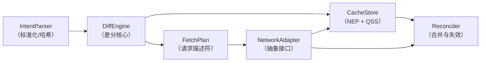

# FractalCache 操作设计文档 v2.0

## 0. 术语表（统一前置定义）

| 术语             | 缩写           | 定义                                                                      |
|----------------|--------------|-------------------------------------------------------------------------|
| **实体（Entity）** | -            | 具有唯一 ID 的业务对象，如 `User`, `Post`                                          |
| **标准化实体池**     | NEP          | 全局归一化存储，键为 `(EntityType, ID)`，值为 `EntityRecord`                         |
| **查询片段存储**     | QSS          | 缓存已执行过的列表查询（含排序、过滤、分页区间）                                                |
| **意图（Intent）** | -            | 对一次数据需求的完整描述，包括 `select`, `where`, `orderBy`, `skip`, `take`, `include` |
| **查询片段**       | QuerySegment | QSS 中的一条记录，包含谓词、排序哈希、索引区间、ID 映射                                         |
| **排序哈希**       | SortHash     | 对 `orderBy` 子句标准化后生成的哈希值，用于标识排序顺序                                       |
| **过滤哈希**       | FilterHash   | 对 `where` 子句标准化后生成的哈希值，用于快速比较谓词                                         |
| **差分引擎**       | DiffEngine   | 核心模块，对比 Intent 与缓存状态，输出 `FetchPlan`                                     |
| **取数计划**       | FetchPlan    | 包含“主获取”（补ID）和“富化获取”（补字段）的请求描述                                           |
| **合并器**        | Reconciler   | 处理网络响应，更新 NEP 和 QSS，维护区间连续性与元数据                                         |
| **关系元数据**      | RelationMeta | 存储在父实体记录中，描述子关系拉取状态（谓词、耗尽标记、索引区间）                                       |
| **幽灵父问题**      | GhostParent  | 父实体存在，但从未请求过其子关系，无法区分“空集合”与“未请求”                                        |

---

## 1. 模块化架构总览

FractalCache 由以下核心模块组成，各模块通过明确定义的接口协作，内部实现完全封装。



```text
[ 组件 ] 
   │
   ▼
[ Intent ]  (entityType, where, orderBy, skip, take, include)
   │
   ▼
[ IntentNormalizer ]   ←────┐
   │                        │ 依赖 IQueryStore
   ├─ 提取占位符，生成 whereTemplate 和 parameters
   ├─ 计算 definitionId = computeDefinitionId(...)
   ├─ 计算 paramHash = computeParamHash(parameters)
   ├─ 从 IQueryStore 获取/创建 QueryDefinition
   └─ 从 IQueryStore 获取/创建 QueryBinding
   │
   ▼
[ DiffEngine ] 
   │ 输入：Intent, QueryBinding
   │ 输出：FetchPlan (主获取 + 富化获取 + 关系获取)
   │
   ▼
[ NetworkAdapter ]  (抽象接口，可对接 REST/GraphQL)
   │
   ▼
[ Reconciler ] 
   ├─ 更新 QueryBinding：mergeInterval, indexToId, isExhausted
   ├─ 更新 NEP：合并 data 和 fieldMask
   ├─ 更新父实体的 relations 数组（同步 indexToId 视图）
   └─ 递归处理 include 子查询（调用 IntentNormalizer + DiffEngine）
```

### 接口定义（TypeScript）

```typescript
// ---------- 存储模块接口 ----------
interface IEntityPool {
  getRecord<T>(type: string, id: ID): EntityRecord<T> | undefined;
  
  updateRecord<T>(type: string, id: ID, updater: (rec: EntityRecord<T>) => void): void;
  
  // ... 批量获取、按条件查询等
}

interface IQuerySegmentStore {
  findSegment(sortHash: string, filterHash: string): QuerySegment | undefined;
  
  addSegment(segment: QuerySegment): void;
  
  mergeInterval(sortHash: string, filterHash: string, newInterval: [number, number], idMap: Map<number, ID>): void;
  
  markDirty(sortHash: string, filterHash: string): void;
}

// ---------- 差分引擎接口 ----------
interface IDiffEngine {
  computeFetchPlan(intent: Intent): FetchPlan;
}

// ---------- 网络适配器抽象 ----------
interface INetworkAdapter {
  fetchIds(request: IdListRequest): Promise<ID[]>;           // 只获取 ID 列表
  fetchEntities(request: EntityFetchRequest): Promise<EntityData[]>; // 获取完整/部分实体
}

// ---------- 合并器接口 ----------
interface IReconciler {
  reconcileIds(response: IdListResponse, originalIntent: Intent): void;
  
  reconcileEntities(response: EntityData[]): void;
}
```

---

## 2. 存储层模块（CacheStore）

### 2.1 标准化实体池（NEP）—— 细化定义

```typescript
interface EntityRecord<T = any> {
  // 原始数据字段（已加载的部分）
  data: Partial<T>;
  
  // 明确“已知”的字段集合，未在 mask 中的字段视为缺失
  fieldMask: Set<keyof T>;
  
  // 元数据（访问频率、版本、乐观标记）
  meta: {
    lastAccess: number;      // 用于 LRU 淘汰
    version?: string | number; // 可选，服务端提供的版本戳
    isOptimistic: boolean;   // 是否为未落地的乐观更新
  };
  
  // 关系存储（纯 ID 引用，不嵌套对象）
  relations: {
    [relationName: string]: ID | ID[] | null; // null 表示明确为空
  };
  
  // 关系元数据：记录每个子关系是通过什么谓词、哪些分页区间拉取的
  relationMetadata: Map<string, RelationMeta>;
}

interface RelationMeta {
  lastPredicate: FilterAST;      // 拉取子实体时使用的过滤条件
  isExhausted: boolean;         // 是否已获取该关系下所有满足条件的子实体
  intervals: Array<[number, number]>; // 已加载的子实体在关系列表中的索引区间（已合并）
  totalCount?: number;          // 可选，服务端返回的总数（若支持）
}
```

**设计决策**：

- 关系元数据**以父实体为粒度存储**，而非全局，避免不同父实体对同一子表的查询相互污染。但通过全局谓词缓存（见扩展点）可优化重复查询。
- `intervals` 采用**不重叠的有序区间数组**，每次合并时执行**区间合并算法**（见附录伪代码）。

### 2.2 查询片段存储（QSS）—— 细化定义

```typescript
interface QuerySegment {
  // 唯一标识（复合主键）
  sortHash: string;        // 基于 orderBy 生成
  filterHash: string;      // 基于 where 生成
  
  predicate: FilterAST;    // 标准化后的原始谓词，用于子集/超集判断
  
  // 已加载的连续索引区间（合并后），如 [[0,9], [20,29]]
  intervals: Array<[number, number]>;
  
  // 索引 → ID 映射，用于快速将窗口转换为 ID 列表
  indexToId: Map<number, ID>;
  
  // 是否已拉取至服务器尾部（即后续无更多数据）
  isExhausted: boolean;
  
  // 标记为“脏”，下次访问需重新验证
  dirty: boolean;
  
  // 最后验证时间戳（用于 TTL 策略）
  lastValidateAt: number;
}
```

**关键操作**：`mergeInterval`

- 输入：`sortHash`, `filterHash`, `[start, end]`, `idMap`
- 步骤：
    1. 找到对应的 QuerySegment，若无则新建。
    2. 将新区间插入 `intervals`，合并重叠或相邻的区间。
    3. 将 `idMap` 中的映射关系写入 `indexToId`。
    4. 若新区间的 `end` 小于服务端返回的 `total` 且 `end` 是当前最大索引，则根据 `hasMore` 标记更新 `isExhausted`。

> **边界处理**：当 `indexToId` 已存在某索引时，以新数据为准（覆盖）。这是由于列表可能因数据变更而发生变化，保守策略是信任最新响应。

---

## 3. 查询表示模块（IntentParser）

### 3.1 Intent 标准化

```typescript
interface Intent<T = any> {
  entityType: string;
  select?: Array<keyof T>;
  where: FilterAST;
  orderBy: Array<OrderSpec>;
  skip: number;
  take: number;
  include?: Array<RelationIntent>;
}

interface RelationIntent extends Intent {
  relationName: string;   // 父实体中的关联字段名
  required?: boolean;     // true: inner join, false: left join (默认 true)
}
```

**标准化规则**：

1. `orderBy`：按字段名升序排列，`ASC/DESC` 字符串归一化，生成 `SortHash`（如 `md5('createdAt:ASC,id:ASC')`）。
2. `where`：递归对 AST 节点按键名排序，移除空白与注释，生成 `FilterHash`。
3. `select`：去重，若无则默认全部字段（但引擎可优化）。
4. `skip`/`take`：非负整数，`take` 为 0 视为无效查询。

### 3.2 谓词关系判定（子集/超集）

提供 `PredicateUtils` 模块：

- `isSubset(astA, astB)`：是否 `A` 是 `B` 的子集（即 `A` 条件更严格）。
- `isSuperset(astA, astB)`：是否 `A` 是 `B` 的超集（即 `A` 条件更宽松）。
- `difference(astA, astB)`：返回逻辑表达式 `A AND NOT B`。

> **注意**：由于 AST 可能包含复杂嵌套，实际工程中可采用**启发式判定**（如仅支持合取范式 CNF）或直接依赖 FilterHash 相等 +
> 手动维护谓词包含关系。文档建议实现**精确判定**，但预留扩展点允许注入自定义判定器。

---

## 4. 差分引擎模块（DiffEngine）

DiffEngine 是核心组件，它协调不同的策略来计算获取计划。引擎遵循固定的工作流程：

1. 水平检查 → 获取目标窗口中的缓存 ID 和缺失区间
2. 垂直检查 → 检查缓存实体的字段完整性
3. 生成分页请求 → 针对缺失区间
4. 生成字段补全请求 → 针对缺失字段
5. 生成关系请求 → 针对包含的关系
6. 去重和合并 → 合并相似请求

实际实现使用可配置的策略模式：

```typescript
export class DiffEngine implements IDiffEngine {
  private readonly config: DiffEngineConfig;
  private readonly entityPool: INormalizedEntityPool;
  private readonly bindingStore: IQueryBindingStore;
  
  constructor(config: DiffEngineConfig, entityPool: INormalizedEntityPool, bindingStore: IQueryBindingStore) {
    this.config = config;
    this.entityPool = entityPool;
    this.bindingStore = bindingStore;
  }
  
  computeFetchPlan(intent: Intent): FetchPlan {
    const context: FetchContext = {
      intent,
      entityPool: this.entityPool,
      bindingStore: this.bindingStore,
      utils: {
        computeDefinitionId,
        computeParamHash,
        extractTemplate,
        extractParams,
      }
    };
    
    // 步骤 1: 水平检查
    const horizontalResult = this.config.horizontalCheck.check(intent, this.bindingStore);
    
    // 从窗口中获取缓存的实体 ID（非空值）
    const cachedIds = horizontalResult.windowIds.filter(id => id !== null) as string[];
    
    // 步骤 2: 垂直检查
    const missingMap = this.config.verticalCheck.check(
      intent.entityType,
      cachedIds,
      intent.select || new Set(),
      this.entityPool
    );
    
    // 步骤 3: 生成分页请求
    const paginationRequests = this.config.paginationRequest.generateRequests(
      horizontalResult.missingIntervals,
      intent,
      context
    );
    
    // 步骤 4: 生成字段补全请求
    const fieldRequests = this.config.fieldFetch.generateRequests(
      missingMap,
      intent.entityType,
      context
    );
    
    // 步骤 5: 生成关系请求
    let relationRequests: DataRequest[] = [];
    if (intent.include) {
      for (const rel of intent.include) {
        const relReqs = this.config.relationRequest.generateRequests(
          rel,
          cachedIds,
          this.entityPool,
          context
        );
        relationRequests.push(...relReqs);
      }
    }
    
    // 步骤 6: 去重和合并
    let allRequests = [...paginationRequests, ...fieldRequests, ...relationRequests];
    if (this.config.requestDeduplication) {
      allRequests = this.config.requestDeduplication.deduplicate(allRequests);
    }
    
    return {requests: allRequests};
  }
}
```

### 4.1 接口定义

DiffEngine 使用策略模式，具有可插拔的组件：

```typescript
/**
 * 缓存引擎的核心接口。
 * 将 Intent 与当前缓存（NEP + QBS）进行比较，并生成最小的 FetchPlan。
 */
export interface IDiffEngine {
  computeFetchPlan(intent: Intent): FetchPlan;
}

/**
 * DiffEngine 的配置。
 * 它包含控制差异计算行为的所有可插拔策略实例。
 */
export interface DiffEngineConfig {
  /**
   * 水平检查策略：确定目标窗口中哪些索引有缓存的实体 ID
   * 以及哪些区间缺失。
   */
  horizontalCheck: HorizontalCheckStrategy;
  
  /**
   * 垂直检查策略：检查实体 ID 列表中缺少哪些字段。
   */
  verticalCheck: VerticalCheckStrategy;
  
  /**
   * 基于字段缺失映射生成字段获取请求的策略。
   */
  fieldFetch: FieldFetchStrategy;
  
  /**
   * 基于缺失区间生成分页请求的策略。
   */
  paginationRequest: PaginationRequestStrategy;
  
  /**
   * 为给定关系意图和父 ID 生成关系（嵌套）请求的策略。
   */
  relationRequest: RelationRequestStrategy;
  
  /**
   * 用于去重和合并生成请求的可选策略。
   * 如果未提供，则不执行去重。
   */
  requestDeduplication?: RequestDeduplicationStrategy;
}
```

### 4.2 上下文对象

策略接收一个上下文对象，其中包含原始意图和实用函数：

```typescript
/**
 * 在获取计划计算期间传递给策略的上下文对象。
 * 它提供对存储、原始意图和实用函数的访问。
 */
export interface FetchContext {
  /**
   * 正在为其计算获取计划的原始意图。
   */
  intent: Intent;
  
  /**
   * 用于访问缓存实体记录的实体池。
   */
  entityPool: INormalizedEntityPool;
  
  /**
   * 用于访问缓存列表查询结果的查询绑定存储。
   */
  bindingStore: IQueryBindingStore;
  
  /**
   * 用于哈希和提取查询模板/参数的实用函数。
   */
  utils: {
    /**
     * 基于实体类型、orderBy 和 where 条件模板计算定义 ID。
     * @param entityType - 实体类型名称。
     * @param orderBy - 排序规范数组。
     * @param whereTemplate - where 条件的模板部分（带参数占位符）。
     * @returns 唯一标识查询形状的字符串。
     */
    computeDefinitionId: (entityType: string, orderBy: OrderSpec[], whereTemplate: any) => string;
    
    /**
     * 计算 where 条件参数值的哈希。
     * @param params - 提取的参数值。
     * @returns 字符串哈希。
     */
    computeParamHash: (params: any) => string;
    
    /**
     * 从完整的 where 条件对象中提取模板部分。
     * 模板用占位符替换实际参数值。
     * @param where - 完整的 where 条件。
     * @returns 模板对象。
     */
    extractTemplate: (where: any) => any;
    
    /**
     * 从完整的 where 条件对象中提取参数值。
     * @param where - 完整的 where 条件。
     * @returns 包含所有参数值的对象。
     */
    extractParams: (where: any) => any;
  };
}
```

### 4.3 策略接口

#### 4.3.1 水平检查策略

```typescript
/**
 * 水平检查（ID 级别缓存分析）的策略接口。
 * 确定目标窗口 [skip, skip+take) 中哪些索引有缓存的实体 ID
 * 以及哪些区间缺失。
 */
export interface HorizontalCheckStrategy {
  /**
   * 执行水平检查以确定缓存的实体 ID 和缺失区间。
   * @param intent - 指定目标窗口和查询参数的意图
   * @param bindingStore - 包含缓存列表查询结果的查询绑定存储
   * @returns 包含缓存 ID、缺失区间和获取标志的 HorizontalResult
   */
  check(intent: Intent, bindingStore: IQueryBindingStore): HorizontalResult;
}

/**
 * 水平检查（ID 级别缓存分析）的结果。
 */
export interface HorizontalResult {
  /** 请求窗口中已在缓存中的 ID，按正确顺序；缺失位置 = null */
  windowIds: Array<string | null>;
  /** 尚未缓存且需要从服务器获取的索引区间 */
  missingIntervals: Array<[number, number]>;
  /** 是否需要主获取（分页请求） */
  needIdFetch: boolean;
}
```

默认实现包含配置选项：

```typescript
interface HorizontalCheckConfig {
  /**
   * 是否使用缓存。如果为 false，则始终返回缺失区间。
   */
  useCache: boolean;
  /**
   * 是否允许部分缓存（非连续区间）。如果为 false，
   * 将任何缺失区间视为完全窗口缺失。
   */
  allowPartialCache: boolean;
  /**
   * 将缺失区间合并为一个区间的最大间隙。
   * 默认为 0（不合并）。
   */
  maxIntervalMergeGap: number;
}

export class DefaultHorizontalCheck implements HorizontalCheckStrategy {
  private readonly config: HorizontalCheckConfig;
  
  constructor(config: HorizontalCheckConfig) {
    this.config = config;
  }
  
  check(intent: Intent): HorizontalResult {
    // 如果禁用缓存，返回完整缺失区间
    if (!this.config.useCache) {
      return {
        windowIds: Array(intent.take).fill(null),
        missingIntervals: [[intent.skip, intent.skip + intent.take - 1]],
        needIdFetch: true
      };
    }
    
    // 对于现在，返回基本实现，假设没有缓存
    // 这将在 QueryBinding 结构完全实现后扩展
    return {
      windowIds: Array(intent.take).fill(null),
      missingIntervals: [[intent.skip, intent.skip + intent.take - 1]],
      needIdFetch: true
    };
  }
}
```

#### 4.3.2 垂直检查策略

```typescript
/**
 * 垂直检查（字段级别缓存分析）的策略接口。
 * 检查实体 ID 列表中缺少哪些字段。
 */
export interface VerticalCheckStrategy {
  /**
   * 执行垂直检查以确定给定实体 ID 的缺失字段。
   * @param entityType - 正在检查的实体类型
   * @param ids - 要检查的实体 ID 列表
   * @param requiredFields - 必需的字段集
   * @param entityPool - 包含缓存实体记录的实体池
   * @returns 将实体 ID 映射到缺失字段集的 FieldMissingMap
   */
  check(
    entityType: string,
    ids: string[],
    requiredFields: Set<string>,
    entityPool: INormalizedEntityPool
  ): FieldMissingMap;
}

/**
 * 实体 ID 到这些实体缺失字段集的映射。
 * 垂直检查策略使用它来报告每个实体 ID 的缺失字段。
 */
export type FieldMissingMap = Map<string, Set<string>>;
```

默认实现：

```typescript
interface VerticalCheckConfig {
  /**
   * 是否使用实体上存储的全局字段掩码。
   */
  useGlobalFieldMask: boolean;
  /**
   * 字段掩码来源：来自实体记录或查询形状。
   */
  fieldMaskSource: 'entity' | 'query';
  /**
   * 处理缺失实体的策略：'strict' 将所有字段视为缺失，
   * 'relaxed' 忽略缺失实体。
   */
  requiredFieldsPolicy: 'strict' | 'relaxed';
}

export class DefaultVerticalCheck implements VerticalCheckStrategy {
  private readonly config: VerticalCheckConfig;
  
  constructor(config: VerticalCheckConfig) {
    this.config = config;
  }
  
  check(
    entityType: string,
    ids: string[],
    requiredFields: Set<string>,
    entityPool: INormalizedEntityPool
  ): FieldMissingMap {
    const missingMap = new Map<string, Set<string>>();
    
    for (const id of ids) {
      const record = entityPool.getRecord(entityType, id);
      
      if (!record) {
        // 实体在池中不存在
        if (this.config.requiredFieldsPolicy === 'strict') {
          missingMap.set(id, new Set(requiredFields));
        }
        // 如果是 'relaxed'，跳过此实体
        continue;
      }
      
      // 基于字段掩码计算缺失字段
      const missing = new Set<string>();
      for (const field of requiredFields) {
        if (!record.fieldMask.has(field as keyof typeof record.data)) {
          missing.add(field);
        }
      }
      
      if (missing.size > 0) {
        missingMap.set(id, missing);
      }
    }
    
    return missingMap;
  }
}
```

#### 4.3.3 字段获取策略

```typescript
/**
 * 生成字段补全请求的策略接口。
 * 生成 DataRequest 对象以获取实体的缺失字段。
 */
export interface FieldFetchStrategy {
  /**
   * 基于字段缺失映射生成字段补全请求。
   * @param missingMap - 实体 ID 到缺失字段集的映射
   * @param entityType - 需要字段补全的实体类型
   * @param context - 包含意图和实用函数的获取上下文
   * @returns 字段补全的 DataRequest 对象数组
   */
  generateRequests(
    missingMap: FieldMissingMap,
    entityType: string,
    context: FetchContext
  ): DataRequest[];
}
```

默认实现带有配置：

```typescript
interface FieldFetchConfig {
  /**
   * 确定批量字段的阈值。在超过此比例的实体中缺失的字段
   * 将被分组到批量请求中。
   */
  batchThreshold: number;
  /**
   * 单个批量请求中的最大 ID 数量。
   */
  maxBatchSize: number;
  /**
   * 处理低频字段的策略：'per-entity' 为每个实体创建单独请求
   * 'merge-all' 将所有低频字段合并到一个请求中。
   */
  lowFrequencyStrategy: 'per-entity' | 'merge-all';
  /**
   * 是否优先使用基于 ID 的请求进行字段补全。
   */
  preferIdRequest: boolean;
}

export class DefaultFieldFetchStrategy implements FieldFetchStrategy {
  private readonly config: FieldFetchConfig;
  
  constructor(config: FieldFetchConfig) {
    this.config = config;
  }
  
  generateRequests(
    missingMap: FieldMissingMap,
    entityType: string,
    context: FetchContext
  ): DataRequest[] {
    if (missingMap.size === 0) {
      return [];
    }
    
    // 计算每个字段缺失多少实体
    const fieldCount = new Map<string, number>();
    for (const [, fields] of missingMap) {
      for (const field of fields) {
        fieldCount.set(field, (fieldCount.get(field) || 0) + 1);
      }
    }
    
    // 基于阈值确定批量字段
    const bulkFields = new Set<string>();
    const totalEntities = missingMap.size;
    
    for (const [field, count] of fieldCount) {
      if (count / totalEntities >= this.config.batchThreshold) {
        bulkFields.add(field);
      }
    }
    
    const requests: DataRequest[] = [];
    
    // 为高频字段生成批量请求
    if (bulkFields.size > 0) {
      // 按缺失的批量字段对实体进行分组
      const bulkFieldGroups = new Map<string, string[]>();
      
      for (const [id, fields] of missingMap) {
        const bulkFieldsForEntity = [...fields].filter(f => bulkFields.has(f)).join(',');
        if (bulkFieldsForEntity) {
          if (!bulkFieldGroups.has(bulkFieldsForEntity)) {
            bulkFieldGroups.set(bulkFieldsForEntity, []);
          }
          bulkFieldGroups.get(bulkFieldsForEntity)!.push(id);
        }
      }
      
      // 为每组创建请求
      for (const [fieldsStr, ids] of bulkFieldGroups) {
        const fields = fieldsStr.split(',') as string[];
        
        // 如需要，按批次分割
        for (let i = 0; i < ids.length; i += this.config.maxBatchSize) {
          const batch = ids.slice(i, i + this.config.maxBatchSize);
          
          const request: DataRequest = {
            entityType,
            mode: {type: 'id', ids: batch},
            where: context.intent.where,
            orderBy: context.intent.orderBy,
            select: new Set(fields)
          };
          
          requests.push(request);
        }
      }
    }
    
    // 基于策略处理剩余（低频）字段
    if (this.config.lowFrequencyStrategy === 'per-entity') {
      // 为每个实体及其低频字段创建单独请求
      for (const [id, fields] of missingMap) {
        const lowFreqFields = [...fields].filter(f => !bulkFields.has(f));
        if (lowFreqFields.length > 0) {
          const request: DataRequest = {
            entityType,
            mode: {type: 'id', ids: [id]},
            where: context.intent.where,
            orderBy: context.intent.orderBy,
            select: new Set(lowFreqFields)
          };
          
          requests.push(request);
        }
      }
    } else if (this.config.lowFrequencyStrategy === 'merge-all') {
      // 收集所有低频字段和需要它们的实体
      const allLowFreqFields = new Set<string>();
      const allLowFreqEntityIds = new Set<string>();
      
      for (const [id, fields] of missingMap) {
        const lowFreqFields = [...fields].filter(f => !bulkFields.has(f));
        if (lowFreqFields.length > 0) {
          lowFreqFields.forEach(f => allLowFreqFields.add(f));
          allLowFreqEntityIds.add(id);
        }
      }
      
      if (allLowFreqFields.size > 0 && allLowFreqEntityIds.size > 0) {
        const entityIds = Array.from(allLowFreqEntityIds);
        
        // 如需要，按批次分割
        for (let i = 0; i < entityIds.length; i += this.config.maxBatchSize) {
          const batch = entityIds.slice(i, i + this.config.maxBatchSize);
          
          const request: DataRequest = {
            entityType,
            mode: {type: 'id', ids: batch},
            where: context.intent.where,
            orderBy: context.intent.orderBy,
            select: allLowFreqFields
          };
          
          requests.push(request);
        }
      }
    }
    
    return requests;
  }
}
```

#### 4.3.4 分页请求策略

```typescript
/**
 * 生成分页请求的策略接口。
 * 创建 DataRequest 对象以获取分页列表中的缺失区间。
 */
export interface PaginationRequestStrategy {
  /**
   * 为给定的缺失区间生成分页请求。
   * @param missingIntervals - 需要获取的 [start, end] 区间数组
   * @param intent - 查询的原始意图
   * @param context - 包含意图和实用函数的获取上下文
   * @returns 分页的 DataRequest 对象数组
   */
  generateRequests(
    missingIntervals: Array<[number, number]>,
    intent: Intent,
    context: FetchContext
  ): DataRequest[];
}
```

默认实现：

```typescript
interface PaginationRequestConfig {
  /**
   * 合并区间策略：'none' 保持全部分离，'adjacent' 合并接触的区间，
   * 'all' 将全部合并为一个请求。
   */
  intervalMergeStrategy: 'none' | 'adjacent' | 'all';
  /**
   * 是否允许获取超出请求窗口边界的项目。
   */
  allowOverfetch: boolean;
  /**
   * 单个分页请求中获取的最大项目数量。
   */
  maxTakePerRequest: number;
}

export class DefaultPaginationRequestStrategy implements PaginationRequestStrategy {
  private readonly config: PaginationRequestConfig;
  
  constructor(config: PaginationRequestConfig) {
    this.config = config;
  }
  
  generateRequests(
    missingIntervals: Array<[number, number]>,
    intent: Intent,
    context: FetchContext
  ): DataRequest[] {
    if (missingIntervals.length === 0) {
      return [];
    }
    
    // 应用区间合并策略
    let processedIntervals: Array<[number, number]> = [...missingIntervals];
    
    switch (this.config.intervalMergeStrategy) {
      case 'adjacent':
        processedIntervals = this.mergeAdjacentIntervals(processedIntervals);
        break;
      case 'all':
        if (processedIntervals.length > 0) {
          const minStart = Math.min(...processedIntervals.map(interval => interval[0]));
          const maxEnd = Math.max(...processedIntervals.map(interval => interval[1]));
          processedIntervals = [[minStart, maxEnd]];
        }
        break;
      case 'none':
        // 不合并
        break;
    }
    
    // 如果不允许过度获取，则应用窗口裁剪
    if (!this.config.allowOverfetch) {
      const windowStart = intent.skip;
      const windowEnd = intent.skip + intent.take - 1;
      
      const filteredIntervals: Array<[number, number]> = [];
      for (const [start, end] of processedIntervals) {
        const newStart = Math.max(start, windowStart);
        const newEnd = Math.min(end, windowEnd);
        if (newStart <= newEnd) {
          filteredIntervals.push([newStart, newEnd]);
        }
      }
      processedIntervals = filteredIntervals;
    }
    
    const requests: DataRequest[] = [];
    
    // 如果区间超过 maxTakePerRequest，则分割区间
    for (const [start, end] of processedIntervals) {
      const intervalLength = end - start + 1;
      
      if (intervalLength <= this.config.maxTakePerRequest) {
        // 此区间的单个请求
        const request: DataRequest = {
          entityType: intent.entityType,
          mode: {type: 'pagination', skip: start, take: intervalLength},
          where: intent.where,
          orderBy: intent.orderBy,
          ...(intent.select && {select: intent.select})
        };
        
        requests.push(request);
      } else {
        // 将区间分割为多个请求
        let currentStart = start;
        while (currentStart <= end) {
          const currentTake = Math.min(this.config.maxTakePerRequest, end - currentStart + 1);
          
          const request: DataRequest = {
            entityType: intent.entityType,
            mode: {type: 'pagination', skip: currentStart, take: currentTake},
            where: intent.where,
            orderBy: intent.orderBy,
            ...(intent.select && {select: intent.select})
          };
          
          requests.push(request);
          
          currentStart += currentTake;
        }
      }
    }
    
    return requests;
  }
  
  /**
   * 合并相邻区间以减少请求数量。
   * @param intervals - 要合并的 [start, end] 区间数组
   * @returns 合并的 [start, end] 区间数组
   * @private
   */
  private mergeAdjacentIntervals(intervals: Array<[number, number]>): Array<[number, number]> {
    if (intervals.length <= 1) return intervals;
    
    // 按开始位置对区间排序
    const sorted = [...intervals].sort((a, b) => a[0] - b[0]);
    const merged: Array<[number, number]> = [];
    
    if (sorted.length === 0) return merged;
    
    let currentStart = sorted[0][0];
    let currentEnd = sorted[0][1];
    
    for (let i = 1; i < sorted.length; i++) {
      const [nextStart, nextEnd] = sorted[i];
      
      // 如果区间相邻或重叠，则合并它们
      if (nextStart <= currentEnd + 1) {
        currentEnd = Math.max(currentEnd, nextEnd);
      } else {
        // 添加当前区间并开始新区间
        merged.push([currentStart, currentEnd]);
        currentStart = nextStart;
        currentEnd = nextEnd;
      }
    }
    
    // 添加最后区间
    merged.push([currentStart, currentEnd]);
    
    return merged;
  }
}
```

#### 4.3.5 关系请求策略

```typescript
/**
 * 生成关系（嵌套）请求的策略接口。
 * 处理为 include 子句中指定的父实体获取相关实体。
 */
export interface RelationRequestStrategy {
  /**
   * 为给定关系意图和父 ID 生成关系请求。
   * @param relationIntent - 指定关系查询的意图
   * @param parentIds - 需要获取其关系的父实体 ID 列表
   * @param entityPool - 用于访问缓存实体记录的实体池
   * @param context - 包含意图和实用函数的获取上下文
   * @returns 关系获取的 DataRequest 对象数组
   */
  generateRequests(
    relationIntent: RelationIntent,
    parentIds: string[],
    entityPool: INormalizedEntityPool,
    context: FetchContext
  ): DataRequest[];
}
```

#### 4.3.6 请求去重策略

```typescript
/**
 * 请求去重和合并的策略接口。
 * 减少重复请求并合并相似请求以最小化网络调用。
 */
export interface RequestDeduplicationStrategy {
  /**
   * 删除重复请求并在可能的情况下合并相似请求。
   * @param requests - 要去重的 DataRequest 对象数组
   * @returns 具有合并相似请求的唯一 DataRequest 对象数组
   */
  deduplicate(requests: DataRequest[]): DataRequest[];
}
```

### 4.4 数据请求格式

所有策略生成标准化的 DataRequest 对象：

```typescript
/**
 * DataRequest 的模式 - 要么按具体 ID 获取，要么获取分页切片。
 */
export type DataRequestMode =
  | { type: "id"; ids: string[] }          // 获取给定 ID 的完整实体
  | { type: "pagination"; skip: number; take: number }; // 获取排序/过滤列表的切片

/**
 * 统一的请求描述符。
 * 它可以用来：
 * - 获取分页 ID 列表（分页模式）
 * - 获取给定 ID 的完整实体（ID 模式）
 * 在两种情况下，后端**应该**返回所请求字段的完整实体数据。
 */
export interface DataRequest {
  entityType: string;
  mode: DataRequestMode;
  
  /** 过滤条件 - 即使对于 ID 模式也是必需的（由后端用于应用安全/一致性） */
  where: FilterAST;
  /** 排序 - 对于分页模式是必需的，对于 ID 模式是可选的（但为了保持一致性而保留） */
  orderBy: OrderSpec[];
  
  /** 要检索的字段；如果省略，后端应返回所有字段 */
  select?: Set<string>;
  
  /**
   * Reconciler 的额外上下文。
   * 对于关系请求，我们需要知道如何将获取的子 ID 附加到每个父项。
   */
  metadata?: {
    parentBatch?: Array<{
      parentId: string;
      paramHash: string;       // 关系参数的哈希（包括 parentId）
      originalSkip: number;    // 此父项请求的原始 skip
      originalTake: number;    // 此父项请求的原始 take
    }>;
  };
}

/**
 * 包含零个或多个独立请求的计划，由 NetworkAdapter 执行。
 */
export interface FetchPlan {
  requests: DataRequest[];
}
```

---

## 5. 执行与合并模块（Reconciler）

### 5.1 区间合并算法（伪代码）

```typescript
function mergeInterval(existing: [number, number][], newInterval: [number, number]): [number, number][] {
  let [start, end] = newInterval;
  const result: [number, number][] = [];
  let inserted = false;
  
  for (const [s, e] of existing) {
    if (e < start - 1) {
      // 完全在新区间左侧
      result.push([s, e]);
    } else if (s > end + 1) {
      // 完全在新区间右侧，先把新区间插进去
      if (!inserted) {
        result.push([start, end]);
        inserted = true;
      }
      result.push([s, e]);
    } else {
      // 重叠或相邻，合并
      start = Math.min(start, s);
      end = Math.max(end, e);
    }
  }
  if (!inserted) {
    result.push([start, end]);
  }
  return result;
}
```

**`indexToId` 的维护**：区间合并时，`indexToId` 不删除旧映射，仅通过新响应覆盖（按索引）。若出现区间合并后某索引不再属于任何区间（例如因重叠被扩展覆盖），其映射仍然保留，但不会被
`getIdsInWindow` 使用，因为后者仅查询 `intervals` 范围内的索引。为节约内存，可定期清理 `indexToId` 中索引不在任何
`intervals` 的条目。

### 5.2 分页边界情况处理（解决需改进方向3）

**场景1：`skip` 超出最大缓存索引，且片段未 exhausted**  
→ 直接生成主获取请求，`skip = intent.skip`，`take = intent.take`。

**场景2：`skip` 超出最大缓存索引，但片段已 exhausted**  
→ 本地无数据，且服务器无更多 → 返回空列表，缓存片段不变。

**场景3：窗口跨越多个不连续缓存区间，且中间有缺失**  
→ `missingIntervals` 计算：遍历 `[skip, skip+take)`，对每个索引判断是否在任意 `interval` 中，不在则开启新区间。  
→ 生成主获取时，若策略为“合并请求”，则将多个缺失区间合并为一个连续区间（可能引入冗余数据），或拆分为多个独立请求。

**场景4：主获取返回的数据量小于 `take`（服务器截断）**  
→ 更新对应片段的 `isExhausted = true`，并正确插入返回的区间及 ID 映射。若返回的最后一个索引恰好是请求区间的结束，但服务器声明
`hasMore = false`，则标记 exhausted。

**场景5：并发相同 Intent**  
→ 引入**请求去重层**：在执行 FetchPlan 前，检查是否有相同参数的请求正在飞行，复用 Promise。

---

## 6. 关系扩展模块（RelationResolver）

### 6.1 关系缺失判定（解决原不明确点4）

**问题重述**：每个父实体独立存储 `relationMetadata`，如何避免对同一子查询（如 `likes > 100`）的重复请求？

**解决方案**：引入**全局关系谓词缓存**（可选，通过策略开关）。

- 当父实体 `A` 请求子关系 `R` 且谓词为 `P` 且 `isExhausted = true`，则向全局缓存写入
  `(entityType, relationName, filterHash) -> exhausted`。
- 其他父实体请求同一 `(entityType, relationName)` 且谓词是 `P` 的子集时，可直接推断 exhausted 状态，无需再次询问服务器。

**接口扩展**：`IRelationPredicateCache`，默认实现为内存 Map。

### 6.2 递归差分伪代码

```typescript
function processIncludes(parentIntent: Intent, parentIds: ID[]): RelationFetch[] {
  if (!parentIntent.include) return [];
  
  const relationFetches: RelationFetch[] = [];
  
  for (const relIntent of parentIntent.include) {
    // 收集每个父实体对此关系的缺失状态
    const perParentMissing = collectRelationMissing(parentIds, relIntent);
    
    // 批量策略：按 (relationName, where) 聚合父 ID
    const grouped = groupByPredicate(perParentMissing);
    
    for (const [key, group] of grouped) {
      const {where, orderBy, skip, take} = group.representativeIntent;
      const fetch: RelationFetch = {
        type: 'relation',
        relationName: relIntent.relationName,
        parentIds: group.parentIds,
        where,
        orderBy,
        skip: group.globalSkip,   // 全局最小 skip
        take: group.requiredTake  // 根据各父实体的需求计算
      };
      relationFetches.push(fetch);
    }
    
    // 递归：对于子查询本身也可能有 include，此处需深度遍历
    // 注意：子查询的父实体是本次获取的子实体 ID，需在响应合并后递归处理
  }
  
  return relationFetches;
}
```

### 6.3 幽灵父问题解决

**定义**：父实体存在，但 `relationMetadata` 无该关系记录 → 无法区分“确实没有子实体”与“尚未请求过”。

**策略**：

1. 首次访问某关系时，主动向服务器请求（`skip=0, take=1`），若返回空列表且服务器指示 exhausted，则记录 `isExhausted = true` 且
   `intervals` 为空。后续查询可立即返回空。
2. 在父实体记录中增加 `relations[relationName] = null` 表示明确为空（与未定义区别）。
3. 若业务允许，可在父实体查询时通过 `LEFT JOIN` 方式一次性获取子实体计数，避免独立请求。

---

## 7. 可扩展性设计（适配器与策略）

### 7.1 网络适配器抽象

```typescript
interface NetworkAdapter {
  // 仅获取 ID 列表（用于主获取，或关系获取的 ID 列表）
  fetchIds(request: IdListRequest): Promise<IdListResponse>;
  
  // 获取实体数据（可指定字段）
  fetchEntities(request: EntityFetchRequest): Promise<EntityData[]>;
  
  // 将框架的 FilterAST 转换为后端查询语言（SQL, GraphQL, REST params）
  serializeFilter(ast: FilterAST): any;
}
```

**内置实现**：

- `RestAdapter`：将 FilterAST 转为 URL query 参数。
- `GraphQLAdapter`：转为 GraphQL 查询字符串。

### 7.2 失效与验证策略

```typescript
interface InvalidationPolicy {
  // 当实体变更时，标记相关查询片段为 dirty
  onEntityUpdated(entityType: string, entityId: ID, changedFields?: string[]): void;
  
  // 访问查询片段时，检查是否需要重新验证
  shouldRevalidate(segment: QuerySegment): boolean;
}
```

**内置策略**：

- `TimeToLivePolicy`：基于 `lastValidateAt` 与 TTL。
- `DirtyMarkPolicy`：仅依赖 dirty 标记，由应用层手动触发。
- `SubscriptionPolicy`：通过 WebSocket 推送失效事件。

### 7.3 存储持久化扩展

预留 `CachePersistor` 接口，支持将 NEP 与 QSS 序列化到 IndexedDB，实现跨会话缓存。

---

## 8. 附录：完整示例（略）

（此处可插入 2～3 个完整流程示例，限于篇幅，文档仅作提示）

---

## 9. 遗留问题与未来方向

1. **并发写操作与缓存一致性**：乐观更新、冲突检测、版本向量。
2. **复合排序的缓存匹配**：多字段排序的 SortHash 生成及区间复用。
3. **动态参数化查询**：如 `currentUserId` 变量，需纳入哈希计算。
4. **内存压力管理**：LRU 淘汰 NEP 实体，清理 QSS 低访问片段。