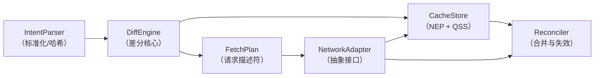

# FractalCache 操作设计文档 v2.0

## 0. 术语表（统一前置定义）

| 术语             | 缩写           | 定义                                                                      |
|----------------|--------------|-------------------------------------------------------------------------|
| **实体（Entity）** | -            | 具有唯一 ID 的业务对象，如 `User`, `Post`                                          |
| **标准化实体池**     | NEP          | 全局归一化存储，键为 `(EntityType, ID)`，值为 `EntityRecord`                         |
| **查询片段存储**     | QSS          | 缓存已执行过的列表查询（含排序、过滤、分页区间）                                                |
| **意图（Intent）** | -            | 对一次数据需求的完整描述，包括 `select`, `where`, `orderBy`, `skip`, `take`, `include` |
| **查询片段**       | QuerySegment | QSS 中的一条记录，包含谓词、排序哈希、索引区间、ID 映射                                         |
| **排序哈希**       | SortHash     | 对 `orderBy` 子句标准化后生成的哈希值，用于标识排序顺序                                       |
| **过滤哈希**       | FilterHash   | 对 `where` 子句标准化后生成的哈希值，用于快速比较谓词                                         |
| **差分引擎**       | DiffEngine   | 核心模块，对比 Intent 与缓存状态，输出 `FetchPlan`                                     |
| **取数计划**       | FetchPlan    | 包含“主获取”（补ID）和“富化获取”（补字段）的请求描述                                           |
| **合并器**        | Reconciler   | 处理网络响应，更新 NEP 和 QSS，维护区间连续性与元数据                                         |
| **关系元数据**      | RelationMeta | 存储在父实体记录中，描述子关系拉取状态（谓词、耗尽标记、索引区间）                                       |
| **幽灵父问题**      | GhostParent  | 父实体存在，但从未请求过其子关系，无法区分“空集合”与“未请求”                                        |

---

## 1. 模块化架构总览

FractalCache 由以下核心模块组成，各模块通过明确定义的接口协作，内部实现完全封装。



```text
[ 组件 ] 
   │
   ▼
[ Intent ]  (entityType, where, orderBy, skip, take, include)
   │
   ▼
[ IntentNormalizer ]   ←────┐
   │                        │ 依赖 IQueryStore
   ├─ 提取占位符，生成 whereTemplate 和 parameters
   ├─ 计算 definitionId = computeDefinitionId(...)
   ├─ 计算 paramHash = computeParamHash(parameters)
   ├─ 从 IQueryStore 获取/创建 QueryDefinition
   └─ 从 IQueryStore 获取/创建 QueryBinding
   │
   ▼
[ DiffEngine ] 
   │ 输入：Intent, QueryBinding
   │ 输出：FetchPlan (主获取 + 富化获取 + 关系获取)
   │
   ▼
[ NetworkAdapter ]  (抽象接口，可对接 REST/GraphQL)
   │
   ▼
[ Reconciler ] 
   ├─ 更新 QueryBinding：mergeInterval, indexToId, isExhausted
   ├─ 更新 NEP：合并 data 和 fieldMask
   ├─ 更新父实体的 relations 数组（同步 indexToId 视图）
   └─ 递归处理 include 子查询（调用 IntentNormalizer + DiffEngine）
```

### 接口定义（TypeScript）

```typescript
// ---------- 存储模块接口 ----------
interface IEntityPool {
  getRecord<T>(type: string, id: ID): EntityRecord<T> | undefined;
  
  updateRecord<T>(type: string, id: ID, updater: (rec: EntityRecord<T>) => void): void;
  
  // ... 批量获取、按条件查询等
}

interface IQuerySegmentStore {
  findSegment(sortHash: string, filterHash: string): QuerySegment | undefined;
  
  addSegment(segment: QuerySegment): void;
  
  mergeInterval(sortHash: string, filterHash: string, newInterval: [number, number], idMap: Map<number, ID>): void;
  
  markDirty(sortHash: string, filterHash: string): void;
}

// ---------- 差分引擎接口 ----------
interface IDiffEngine {
  computeFetchPlan(intent: Intent): FetchPlan;
}

// ---------- 网络适配器抽象 ----------
interface INetworkAdapter {
  fetchIds(request: IdListRequest): Promise<ID[]>;           // 只获取 ID 列表
  fetchEntities(request: EntityFetchRequest): Promise<EntityData[]>; // 获取完整/部分实体
}

// ---------- 合并器接口 ----------
interface IReconciler {
  reconcileIds(response: IdListResponse, originalIntent: Intent): void;
  
  reconcileEntities(response: EntityData[]): void;
}
```

---

## 2. 存储层模块（CacheStore）

### 2.1 标准化实体池（NEP）—— 细化定义

```typescript
interface EntityRecord<T = any> {
  // 原始数据字段（已加载的部分）
  data: Partial<T>;
  
  // 明确“已知”的字段集合，未在 mask 中的字段视为缺失
  fieldMask: Set<keyof T>;
  
  // 元数据（访问频率、版本、乐观标记）
  meta: {
    lastAccess: number;      // 用于 LRU 淘汰
    version?: string | number; // 可选，服务端提供的版本戳
    isOptimistic: boolean;   // 是否为未落地的乐观更新
  };
  
  // 关系存储（纯 ID 引用，不嵌套对象）
  relations: {
    [relationName: string]: ID | ID[] | null; // null 表示明确为空
  };
  
  // 关系元数据：记录每个子关系是通过什么谓词、哪些分页区间拉取的
  relationMetadata: Map<string, RelationMeta>;
}

interface RelationMeta {
  lastPredicate: FilterAST;      // 拉取子实体时使用的过滤条件
  isExhausted: boolean;         // 是否已获取该关系下所有满足条件的子实体
  intervals: Array<[number, number]>; // 已加载的子实体在关系列表中的索引区间（已合并）
  totalCount?: number;          // 可选，服务端返回的总数（若支持）
}
```

**设计决策**：

- 关系元数据**以父实体为粒度存储**，而非全局，避免不同父实体对同一子表的查询相互污染。但通过全局谓词缓存（见扩展点）可优化重复查询。
- `intervals` 采用**不重叠的有序区间数组**，每次合并时执行**区间合并算法**（见附录伪代码）。

### 2.2 查询片段存储（QSS）—— 细化定义

```typescript
interface QuerySegment {
  // 唯一标识（复合主键）
  sortHash: string;        // 基于 orderBy 生成
  filterHash: string;      // 基于 where 生成
  
  predicate: FilterAST;    // 标准化后的原始谓词，用于子集/超集判断
  
  // 已加载的连续索引区间（合并后），如 [[0,9], [20,29]]
  intervals: Array<[number, number]>;
  
  // 索引 → ID 映射，用于快速将窗口转换为 ID 列表
  indexToId: Map<number, ID>;
  
  // 是否已拉取至服务器尾部（即后续无更多数据）
  isExhausted: boolean;
  
  // 标记为“脏”，下次访问需重新验证
  dirty: boolean;
  
  // 最后验证时间戳（用于 TTL 策略）
  lastValidateAt: number;
}
```

**关键操作**：`mergeInterval`

- 输入：`sortHash`, `filterHash`, `[start, end]`, `idMap`
- 步骤：
    1. 找到对应的 QuerySegment，若无则新建。
    2. 将新区间插入 `intervals`，合并重叠或相邻的区间。
    3. 将 `idMap` 中的映射关系写入 `indexToId`。
    4. 若新区间的 `end` 小于服务端返回的 `total` 且 `end` 是当前最大索引，则根据 `hasMore` 标记更新 `isExhausted`。

> **边界处理**：当 `indexToId` 已存在某索引时，以新数据为准（覆盖）。这是由于列表可能因数据变更而发生变化，保守策略是信任最新响应。

---

## 3. 查询表示模块（IntentParser）

### 3.1 Intent 标准化

```typescript
interface Intent<T = any> {
  entityType: string;
  select?: Array<keyof T>;
  where: FilterAST;
  orderBy: Array<OrderSpec>;
  skip: number;
  take: number;
  include?: Array<RelationIntent>;
}

interface RelationIntent extends Intent {
  relationName: string;   // 父实体中的关联字段名
  required?: boolean;     // true: inner join, false: left join (默认 true)
}
```

**标准化规则**：

1. `orderBy`：按字段名升序排列，`ASC/DESC` 字符串归一化，生成 `SortHash`（如 `md5('createdAt:ASC,id:ASC')`）。
2. `where`：递归对 AST 节点按键名排序，移除空白与注释，生成 `FilterHash`。
3. `select`：去重，若无则默认全部字段（但引擎可优化）。
4. `skip`/`take`：非负整数，`take` 为 0 视为无效查询。

### 3.2 谓词关系判定（子集/超集）

提供 `PredicateUtils` 模块：

- `isSubset(astA, astB)`：是否 `A` 是 `B` 的子集（即 `A` 条件更严格）。
- `isSuperset(astA, astB)`：是否 `A` 是 `B` 的超集（即 `A` 条件更宽松）。
- `difference(astA, astB)`：返回逻辑表达式 `A AND NOT B`。

> **注意**：由于 AST 可能包含复杂嵌套，实际工程中可采用**启发式判定**（如仅支持合取范式 CNF）或直接依赖 FilterHash 相等 +
> 手动维护谓词包含关系。文档建议实现**精确判定**，但预留扩展点允许注入自定义判定器。

---

## 4. 差分引擎模块（DiffEngine）

### 4.1 算法总流程（伪代码）

```typescript
function computeFetchPlan(intent: Intent): FetchPlan {
  // 1. 水平检查：确定缺失的 ID 区间
  const horizontalMiss = checkHorizontal(intent);
  
  // 2. 若完全命中（无水平缺失且字段完整），返回空 Plan
  // 3. 生成主获取请求（用于补充 ID）
  const primaryFetch = horizontalMiss.needIdFetch
    ? buildPrimaryRequest(intent, horizontalMiss.missingIntervals)
    : null;
  
  // 4. 垂直检查：对窗口内所有 ID（含缓存+即将获取）检查字段缺失
  const fieldMissingMap = checkVertical(intent, horizontalMiss.windowIds);
  
  // 5. 生成富化获取请求（用于补充字段）
  const enrichmentFetches = buildEnrichmentRequests(fieldMissingMap);
  
  // 6. 递归处理 include 关系（见第7节）
  const relationFetches = processIncludes(intent, horizontalMiss.windowIds);
  
  return new FetchPlan(primaryFetch, enrichmentFetches, relationFetches);
}
```

### 4.2 水平检查：`checkHorizontal` 详细逻辑（解决原不明确点1、3）

**输入**：Intent（含 `where`, `orderBy`, `skip`, `take`）
**输出**：

- `windowIds`: 已缓存在窗口内的 ID 列表（顺序正确）
- `missingIntervals`: 需从服务器获取的索引区间
- `needIdFetch`: 是否需要执行主获取

```typescript
function checkHorizontal(intent): HorizontalResult {
  const {sortHash, filterHash} = normalize(intent);
  const segment = QSS.findSegment(sortHash, filterHash);
  
  // 情况1：无完全匹配的片段 → 全量缺失
  if (!segment) {
    return {
      windowIds: [],
      missingIntervals: [[intent.skip, intent.skip + intent.take - 1]],
      needIdFetch: true
    };
  }
  
  // 情况2：有匹配片段
  const cachedIds = getIdsInWindow(segment, intent.skip, intent.take);
  const missing = computeMissingIntervals(segment.intervals, intent.skip, intent.take);
  
  // 若片段已 exhausted，则所有窗口内的 ID 均已缓存，可直接返回
  if (segment.isExhausted) {
    return {
      windowIds: cachedIds,  // 全部从缓存中取得
      missingIntervals: [],
      needIdFetch: false
    };
  }
  
  // 未 exhausted：需补充缺失区间
  return {
    windowIds: cachedIds,
    missingIntervals: missing,
    needIdFetch: missing.length > 0
  };
}

// 辅助函数：从 intervals 和 indexToId 获取指定窗口内的 ID（顺序保持）
function getIdsInWindow(segment, skip, take): ID[] {
  const ids: ID[] = [];
  for (let i = skip; i < skip + take; i++) {
    if (segment.indexToId.has(i)) {
      ids.push(segment.indexToId.get(i));
    } else {
      ids.push(null); // 占位，表示缺失
    }
  }
  return ids;
}
```

**解决不明确点**：

- **FilterHash 的用途**：在 QSS 中，`(sortHash, filterHash)` 作为复合主键，每个不同的过滤条件（即使排序相同）都对应独立的
  QuerySegment。这避免了不同谓词的片段混淆。
- **谓词拆分的位置**：水平检查**仅负责索引区间缺失**，谓词拆分（即 `PD AND NOT PC`）是在**构建主获取请求**时由
  `buildPrimaryRequest` 根据缓存片段的 `predicate` 生成，不混入水平检查逻辑。

### 4.3 谓词拆分请求构建（解决原不明确点2）

```typescript
function buildPrimaryRequest(intent, missingIntervals): PrimaryFetch {
  const segment = QSS.findSegment(sortHash, filterHash); // 可能为 null
  let whereClause = intent.where;
  
  // 若存在缓存片段且其谓词不是意图谓词的超集，则需取逻辑差集
  if (segment && !isSuperset(segment.predicate, intent.where)) {
    // 构造： (PD AND NOT PC) OR (PD AND skip > 最大缓存索引)
    const notPC = {$not: segment.predicate};
    const part1 = {$and: [intent.where, notPC]};
    
    const maxCachedIndex = Math.max(...segment.intervals.flat());
    const part2 = {
      $and: [
        intent.where,
        {$gt: ['$index', maxCachedIndex]} // 伪代码，实际需翻译成后端支持的语法
      ]
    };
    
    whereClause = {$or: [part1, part2]};
  }
  
  return {
    type: 'primary',
    where: whereClause,
    orderBy: intent.orderBy,
    skip: missingIntervals[0][0], // 简化：取第一个缺失区间的起始
    take: sumLength(missingIntervals) // 总长度
  };
}
```

**边界处理**：当 `missingIntervals` 包含多个不连续区间时，需拆分多个请求还是合并成一个请求？框架提供策略配置（默认合并，利用服务端支持
`OR` 或 `IN` 索引）。

### 4.4 垂直检查：字段级缺失（解决原不明确点5）

```typescript
function checkVertical(intent, windowIds): Map<ID, Set<keyof T>> {
  const missingMap = new Map();
  
  for (const id of windowIds) {
    if (!id) continue; // 缺失的 ID，将在主获取后补全字段
    const record = NEP.getRecord(intent.entityType, id);
    if (!record) {
      // 理论上不应发生，因为 ID 来自 QSS，QSS 保证 indexToId 中的 ID 在 NEP 存在
      missingMap.set(id, new Set(intent.select || allFields));
      continue;
    }
    const missingFields = (intent.select || allFields).filter(
      f => !record.fieldMask.has(f)
    );
    if (missingFields.length) {
      missingMap.set(id, new Set(missingFields));
    }
  }
  
  // 聚合策略：可配置阈值（如 >30% 实体缺失相同字段 → 转为批量获取）
  const threshold = 0.3; // 可配置
  const fieldFrequency = new Map();
  for (const [_, fields] of missingMap) {
    fields.forEach(f => fieldFrequency.set(f, (fieldFrequency.get(f) || 0) + 1));
  }
  
  const bulkFields = new Set();
  for (const [f, count] of fieldFrequency) {
    if (count / windowIds.length > threshold) {
      bulkFields.add(f);
    }
  }
  
  // 返回时，将属于批量字段的条目从 missingMap 移除，单独记录在批量请求中
  // ... 实现略
  
  return missingMap; // 此时 missingMap 仅包含每个 ID 特有的缺失字段
}
```

**阈值可配置**：通过 `CachePolicy` 模块注入。

---

## 5. 执行与合并模块（Reconciler）

### 5.1 区间合并算法（伪代码）

```typescript
function mergeInterval(existing: [number, number][], newInterval: [number, number]): [number, number][] {
  let [start, end] = newInterval;
  const result: [number, number][] = [];
  let inserted = false;
  
  for (const [s, e] of existing) {
    if (e < start - 1) {
      // 完全在新区间左侧
      result.push([s, e]);
    } else if (s > end + 1) {
      // 完全在新区间右侧，先把新区间插进去
      if (!inserted) {
        result.push([start, end]);
        inserted = true;
      }
      result.push([s, e]);
    } else {
      // 重叠或相邻，合并
      start = Math.min(start, s);
      end = Math.max(end, e);
    }
  }
  if (!inserted) {
    result.push([start, end]);
  }
  return result;
}
```

**`indexToId` 的维护**：区间合并时，`indexToId` 不删除旧映射，仅通过新响应覆盖（按索引）。若出现区间合并后某索引不再属于任何区间（例如因重叠被扩展覆盖），其映射仍然保留，但不会被
`getIdsInWindow` 使用，因为后者仅查询 `intervals` 范围内的索引。为节约内存，可定期清理 `indexToId` 中索引不在任何
`intervals` 的条目。

### 5.2 分页边界情况处理（解决需改进方向3）

**场景1：`skip` 超出最大缓存索引，且片段未 exhausted**  
→ 直接生成主获取请求，`skip = intent.skip`，`take = intent.take`。

**场景2：`skip` 超出最大缓存索引，但片段已 exhausted**  
→ 本地无数据，且服务器无更多 → 返回空列表，缓存片段不变。

**场景3：窗口跨越多个不连续缓存区间，且中间有缺失**  
→ `missingIntervals` 计算：遍历 `[skip, skip+take)`，对每个索引判断是否在任意 `interval` 中，不在则开启新区间。  
→ 生成主获取时，若策略为“合并请求”，则将多个缺失区间合并为一个连续区间（可能引入冗余数据），或拆分为多个独立请求。

**场景4：主获取返回的数据量小于 `take`（服务器截断）**  
→ 更新对应片段的 `isExhausted = true`，并正确插入返回的区间及 ID 映射。若返回的最后一个索引恰好是请求区间的结束，但服务器声明
`hasMore = false`，则标记 exhausted。

**场景5：并发相同 Intent**  
→ 引入**请求去重层**：在执行 FetchPlan 前，检查是否有相同参数的请求正在飞行，复用 Promise。

---

## 6. 关系扩展模块（RelationResolver）

### 6.1 关系缺失判定（解决原不明确点4）

**问题重述**：每个父实体独立存储 `relationMetadata`，如何避免对同一子查询（如 `likes > 100`）的重复请求？

**解决方案**：引入**全局关系谓词缓存**（可选，通过策略开关）。

- 当父实体 `A` 请求子关系 `R` 且谓词为 `P` 且 `isExhausted = true`，则向全局缓存写入
  `(entityType, relationName, filterHash) -> exhausted`。
- 其他父实体请求同一 `(entityType, relationName)` 且谓词是 `P` 的子集时，可直接推断 exhausted 状态，无需再次询问服务器。

**接口扩展**：`IRelationPredicateCache`，默认实现为内存 Map。

### 6.2 递归差分伪代码

```typescript
function processIncludes(parentIntent: Intent, parentIds: ID[]): RelationFetch[] {
  if (!parentIntent.include) return [];
  
  const relationFetches: RelationFetch[] = [];
  
  for (const relIntent of parentIntent.include) {
    // 收集每个父实体对此关系的缺失状态
    const perParentMissing = collectRelationMissing(parentIds, relIntent);
    
    // 批量策略：按 (relationName, where) 聚合父 ID
    const grouped = groupByPredicate(perParentMissing);
    
    for (const [key, group] of grouped) {
      const {where, orderBy, skip, take} = group.representativeIntent;
      const fetch: RelationFetch = {
        type: 'relation',
        relationName: relIntent.relationName,
        parentIds: group.parentIds,
        where,
        orderBy,
        skip: group.globalSkip,   // 全局最小 skip
        take: group.requiredTake  // 根据各父实体的需求计算
      };
      relationFetches.push(fetch);
    }
    
    // 递归：对于子查询本身也可能有 include，此处需深度遍历
    // 注意：子查询的父实体是本次获取的子实体 ID，需在响应合并后递归处理
  }
  
  return relationFetches;
}
```

### 6.3 幽灵父问题解决

**定义**：父实体存在，但 `relationMetadata` 无该关系记录 → 无法区分“确实没有子实体”与“尚未请求过”。

**策略**：

1. 首次访问某关系时，主动向服务器请求（`skip=0, take=1`），若返回空列表且服务器指示 exhausted，则记录 `isExhausted = true` 且
   `intervals` 为空。后续查询可立即返回空。
2. 在父实体记录中增加 `relations[relationName] = null` 表示明确为空（与未定义区别）。
3. 若业务允许，可在父实体查询时通过 `LEFT JOIN` 方式一次性获取子实体计数，避免独立请求。

---

## 7. 可扩展性设计（适配器与策略）

### 7.1 网络适配器抽象

```typescript
interface NetworkAdapter {
  // 仅获取 ID 列表（用于主获取，或关系获取的 ID 列表）
  fetchIds(request: IdListRequest): Promise<IdListResponse>;
  
  // 获取实体数据（可指定字段）
  fetchEntities(request: EntityFetchRequest): Promise<EntityData[]>;
  
  // 将框架的 FilterAST 转换为后端查询语言（SQL, GraphQL, REST params）
  serializeFilter(ast: FilterAST): any;
}
```

**内置实现**：

- `RestAdapter`：将 FilterAST 转为 URL query 参数。
- `GraphQLAdapter`：转为 GraphQL 查询字符串。

### 7.2 失效与验证策略

```typescript
interface InvalidationPolicy {
  // 当实体变更时，标记相关查询片段为 dirty
  onEntityUpdated(entityType: string, entityId: ID, changedFields?: string[]): void;
  
  // 访问查询片段时，检查是否需要重新验证
  shouldRevalidate(segment: QuerySegment): boolean;
}
```

**内置策略**：

- `TimeToLivePolicy`：基于 `lastValidateAt` 与 TTL。
- `DirtyMarkPolicy`：仅依赖 dirty 标记，由应用层手动触发。
- `SubscriptionPolicy`：通过 WebSocket 推送失效事件。

### 7.3 存储持久化扩展

预留 `CachePersistor` 接口，支持将 NEP 与 QSS 序列化到 IndexedDB，实现跨会话缓存。

---

## 8. 附录：完整示例（略）

（此处可插入 2～3 个完整流程示例，限于篇幅，文档仅作提示）

---

## 9. 遗留问题与未来方向

1. **并发写操作与缓存一致性**：乐观更新、冲突检测、版本向量。
2. **复合排序的缓存匹配**：多字段排序的 SortHash 生成及区间复用。
3. **动态参数化查询**：如 `currentUserId` 变量，需纳入哈希计算。
4. **内存压力管理**：LRU 淘汰 NEP 实体，清理 QSS 低访问片段。